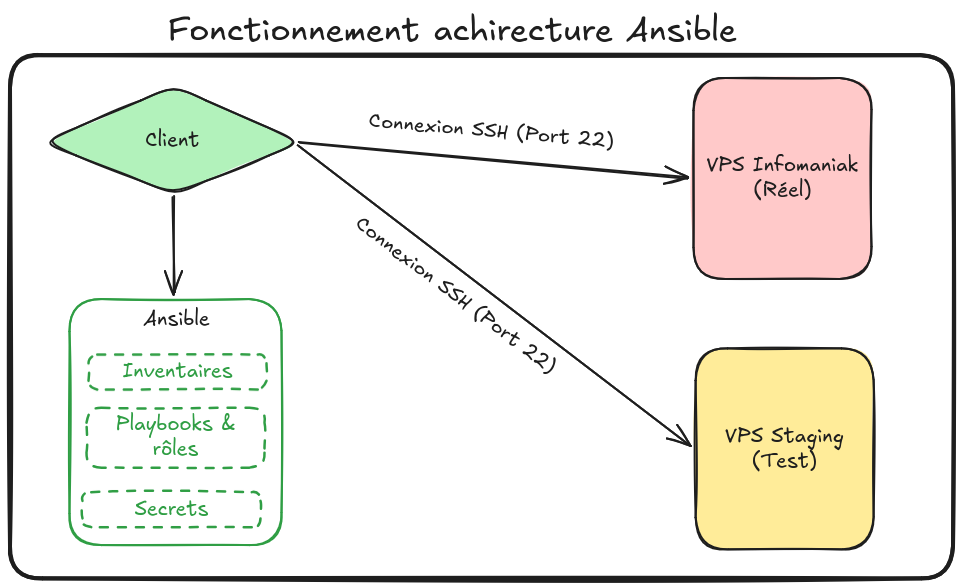

# Architecture - Fonctionnement Ansible


## Informations

  - **Mainteneur :** Louis MEDO
  - **Date de création :** 15 avril 2026

-----

## Contexte

Cette procédure détaille le fonctionnement global et l'organisation de l'Infrastructure as Code (IaC) basée sur Ansible. Elle permet d'automatiser, de standardiser et de sécuriser le déploiement de la plateforme d'hébergement des portfolios étudiants du Lycée Paul-Louis Courier, en adoptant une approche SRE (fiabilité, reproductibilité et sécurité).

-----

## Sommaire

1.  Fonctionnement global de l'infrastructure Ansible
2.  Organisation du dépôt et Séparation des Rôles
3.  Gestion des environnements et Hiérarchie des variables
4.  Stratégie de gestion des secrets (Ansible Vault)

-----

## 1. Fonctionnement global de l'infrastructure Ansible

**Architecture sans agent (Agentless).** Ansible fonctionne sur un modèle "Push". Le nœud de contrôle (votre poste) se connecte aux serveurs cibles via SSH pour y appliquer les configurations déclarées dans les Playbooks, sans nécessiter l'installation d'un agent sur les cibles.



*Schéma - Fonctionnement architecture Ansible*

-----

## 2. Organisation du dépôt et séparation des Rôles

**Modularité des rôles.** L'infrastructure est découpée en rôles distincts pour garantir la réutilisabilité et la lisibilité du code. Le playbook principal (`playbooks/site.yml`) orchestre ces rôles de manière séquentielle.

* **`common`** : Initialise le socle de sécurité (mise à jour système, interdiction du login Root en SSH, configuration du MOTD) et installe les paquets utilitaires de base.
* **`webserver`** : Configure le serveur web (Apache, PHP-FPM), gère la génération des certificats SSL/TLS via Certbot (Infomaniak), et met en place les règles de sécurité HTTP (headers, catch-all).
* **`ci_cd`** : Crée les utilisateurs et les scripts (Wrapper) permettant l'intégration et le déploiement continus (CI/CD) depuis GitHub vers les dossiers locaux en gérant les permissions strictes.
* **`student_deploy`** : Déploie dynamiquement les ressources pour chaque étudiant (VirtualHosts Apache, pools PHP-FPM dédiés, clonage initial des dépôts Git).

-----

## 3. Gestion des environnements et hiérarchie des variables

**Séparation Staging vs Production.** La gestion multi-environnement se fait via les inventaires (`inventories/`). 

Il ne faut jamais modifier le fichier de configuration global pour changer de cible.

* **Staging** : L'inventaire de test (`inventories/staging/hosts.yml`) cible une VM ou un VPS de développement. Ses variables de groupe (`group_vars/all.yml`) définissent un domaine de test (ex: `loutik.eu`) et une liste d'étudiants restreinte.
* **Production** : L'inventaire de production (`inventories/production/hosts.yml`) cible le serveur officiel du lycée. Ses variables définissent le domaine réel (`bts-sio.eu`) et la liste complète des étudiants. La hiérarchie des variables d'Ansible s'assure que les variables du groupe d'inventaire ciblé surchargent les valeurs par défaut.

-----

## 4. Stratégie de gestion des secrets (Ansible Vault)

**Chiffrement des données sensibles.** Les informations critiques (clés SSH privées/publiques, tokens d'API comme `vault_infomaniak_token`) ne doivent jamais être stockées en clair. Elles sont chiffrées dans le fichier `secrets/vault.yml` à l'aide d'Ansible Vault (AES256).

```bash
ansible-playbook -i inventories/production/hosts.yml playbooks/site.yml --ask-vault-pass
```

`-i inventories/production/hosts.yml` : Spécifie le chemin vers le fichier d'inventaire ciblé (ici, l'environnement de production).

`playbooks/site.yml` : Indique le playbook principal à exécuter qui contient l'orchestration des rôles.

`--ask-vault-pass` : Instruction demandant à Ansible de vous inviter interactivement à saisir le mot de passe maître pour déchiffrer le fichier `secrets/vault.yml` à la volée pendant l'exécution.

-----

## Annexe

  - [Documentation officielle Ansible Vault](https://docs.ansible.com/ansible/latest/vault_guide/index.html)