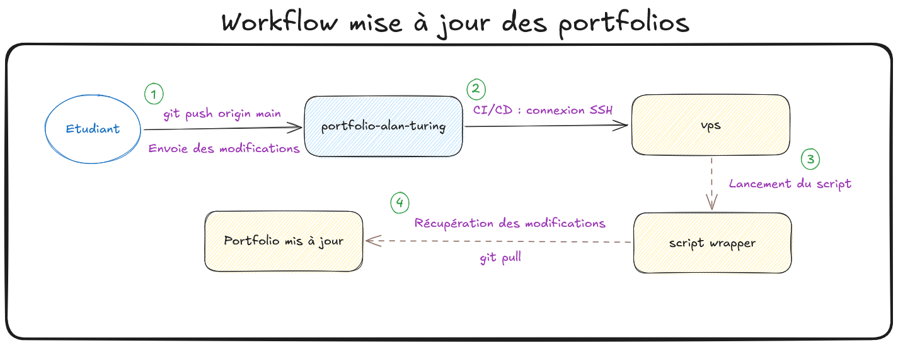

# Architecture - Workflow de déploiement centralisé

## Informations

  - **Mainteneur :** Louis MEDO
  - **Date de création :** 29/03/2026

---

## Contexte

Ce document technique présente l'architecture finale retenue pour le déploiement continu (CI/CD) des portfolios sur le serveur de l'établissement. Il détaille le processus de mise à jour "Zero Touch" utilisant un script wrapper sécurisé pour centraliser les connexions SSH, garantissant une automatisation fluide.

---

## Sommaire

1.  Architecture et étapes du workflow
2.  Cas d'utilisation concret
3.  Technologies et outils impliqués

---

## 1. Architecture et étapes du workflow

*Schéma - Workflow des mises à jour des portfolios étudiant*

Le processus de déploiement s'articule autour de 4 étapes clés illustrées sur le schéma :

1.  **Développement (`git push`) :** L'étudiant envoie ses modifications locales vers son dépôt distant (ex: `portfolio-alan-turing`) hébergé sur l'organisation GitHub de la classe.
2.  **Pipeline CI/CD (Connexion SSH) :** GitHub détecte la mise à jour, lance un environnement automatisé, et établit une connexion sécurisée vers le VPS en utilisant la clé SSH de l'organisation. Lors de cette connexion, il transmet le nom exact du dépôt modifié.
3.  **Interception (Lancement du script) :** Le VPS, configuré pour interdire les terminaux interactifs, force l'exécution du "Script Wrapper". Ce script intercepte le nom du dépôt envoyé par GitHub, valide son format pour bloquer toute tentative d'injection malveillante, et vérifie que le répertoire cible existe.
4.  **Mise à jour (`git pull`) :** Si les vérifications de sécurité sont validées, le script wrapper se place dans le dossier de l'étudiant sur le serveur web et télécharge les dernières modifications pour mettre le site en production.

---

## 2. Cas d'utilisation concret

Alan Turing est en train de finaliser la présentation de ses projets de BTS.

1.  Il modifie le code de sa page `projets.html` sur sa machine et valide le tout avec un `git push`.
2.  Son dépôt GitHub (`portfolio-alan-turing`) déclenche automatiquement l'action CI/CD.
3.  Le serveur de GitHub se connecte au VPS et transmet l'information : `"portfolio-alan-turing"`.
4.  Le script wrapper du VPS s'active, nettoie la chaîne de caractères, navigue dans le dossier `/var/www/portfolios/portfolio-alan-turing`, et exécute la récupération des nouveaux fichiers.
5.  La page web d'Alan est mise à jour en quelques secondes. L'ensemble du processus s'est déroulé de manière invisible et sécurisée, sans nécessiter la création d'une clé SSH individuelle pour Alan.

---

## 3. Technologies et outils impliqués

Voici les briques technologiques et les commandes qui permettent à ce workflow de fonctionner :

  - **Git :** Outil de gestion de versions décentralisé.
      - **`git push origin main` :** Commande envoyant l'historique local validé vers la branche principale (`main`) du serveur distant (`origin`).
      - **`git pull` :** Commande téléchargeant les nouveautés du dépôt distant pour les fusionner instantanément avec les fichiers présents sur le serveur web.
  - **GitHub Actions (CI/CD) :** Service d'automatisation intégré à GitHub. Il permet d'exécuter des suites d'instructions (les pipelines) en réaction à des événements (comme un envoi de code).
  - **SSH (Secure Shell) :** Protocole réseau garantissant une communication chiffrée de bout en bout entre GitHub et le VPS pour l'authentification et l'exécution de commandes à distance.
  - **Script Wrapper (Bash) :** Un programme d'encapsulation rédigé en langage Bash (le langage de commande natif de Linux). Il agit comme une barrière de sécurité (un proxy local) : il prend le contrôle direct de la session SSH entrante, dicte les actions autorisées, et empêche l'exécution de commandes système arbitraires.