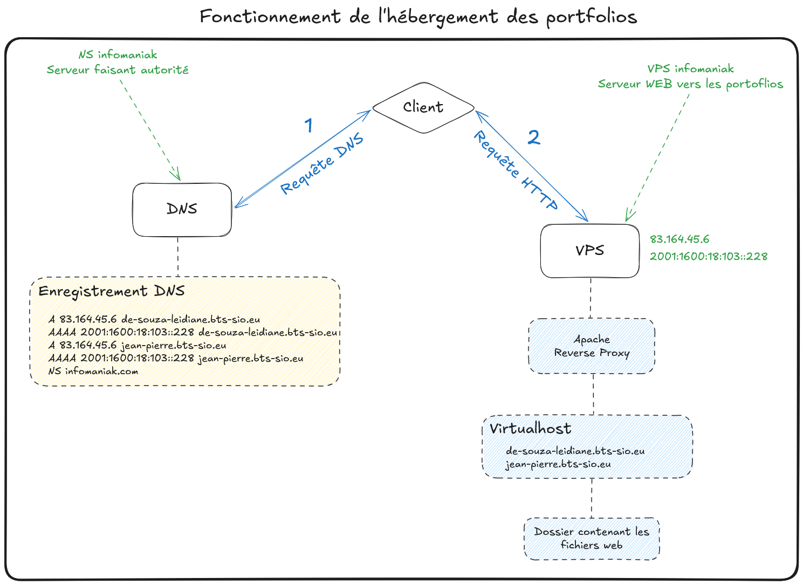

# **📚 Accueil**

Bienvenue sur le portail de documentation technique dédié à l'**hébergement externalisé des portfolios étudiants**. Ce wiki centralise l'architecture, les configurations et les procédures d'exploitation du projet.

---
## **🏢 Contexte et Enjeux**

Les étudiants doivent concevoir et déployer un portfolio professionnel dynamique (PHP, bases de données, etc.). Face à l'absence de solutions gratuites répondant aux exigences techniques et de sécurité de la formation, une infrastructure sur-mesure a été déployée. Reposant sur un Serveur Privé Virtuel (VPS) et le nom de domaine **bts-sio.eu**, elle garantit un hébergement professionnel, isolé et performant pour chaque étudiant.

---
## **🎞️ Architecture et Flux de Données**

*Architecture de résolution et de routage des requêtes HTTP*

**Fonctionnement de l'infrastructure :**

1. **Résolution DNS :** Le navigateur du client effectue une requête vers les serveurs faisant autorité d'Infomaniak. La zone DNS traduit le sous-domaine de l'étudiant (ex: `jean-pierre.bts-sio.eu`) en adresse IP (IPv4 ou IPv6) pointant vers le VPS.

2. **Routage HTTP/Web :** Le client envoie sa requête web au VPS. Le service **Apache** réceptionne la demande et, grâce à sa configuration en **VirtualHosts**, identifie le sous-domaine ciblé pour servir le bon dossier système contenant les fichiers web de l'étudiant, tout en isolant les environnements.

---
## **💡 Naviguer dans la documentation**

Cette documentation est structurée selon le **framework documentaire Diátaxis**. C'est un standard de l'industrie qui sépare l'information selon le besoin de l'utilisateur (comprendre la théorie vs appliquer la pratique) afin de faciliter la recherche d'informations et la maintenance.

### **📂 Arborescence de la documentation**

Les grands domaines du projet (Infrastructure, Sécurité, Serveur Web, CI/CD) sont organisés de manière autonome. Chaque section contient le découpage suivant :

* **🧠 Architecture (`architecture.md`)** : Le "Pourquoi". Explication des choix techniques, du fonctionnement du service et des règles de sécurité.
* **🛠️ Déploiement (`deploiement/`)** : Le "Comment installer". Procédures pas-à-pas d'installation, de configuration initiale et de mise en production.
* **🚑 Runbooks (`runbooks/`)** : Le "Comment exploiter". Guides utilisateurs, tâches quotidiennes de maintenance et procédures de résolution d'incidents.

### **📌 Guide de navigation**

- **Phase d'initialisation (Build) :** Parcourez les dossiers `deploiement/` de chaque domaine (de l'Infrastructure au CI/CD) pour monter le serveur de zéro.
- **Phase d'exploitation (Run) :** Référez-vous directement aux dossiers `runbooks/` du service concerné pour vos opérations quotidiennes ou le dépannage.